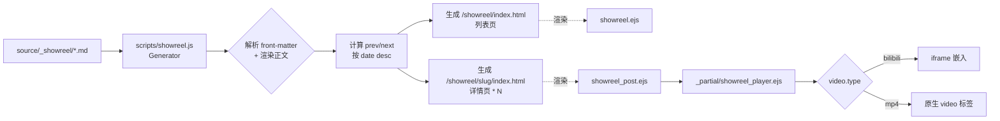

# SHOWREEL 音效作品展示模块 — 规格说明 v1.1.0

| 字段 | 值 |
| --- | --- |
| 版本 | v1.1.0 |
| 状态 | 📝 待实施 |
| 创建日期 | 2026-04-24 |
| 关联 Changelog | `CHANGELOG.md` → v1.1.0（待发布） |
| 实施范围 | Hexo Quiet 主题 + 根目录 scripts / scaffolds / source |

---

## 1. 产品概述

为 DocX 的 Hexo 个人博客新增"音效设计作品展示平台（SHOWREEL）"模块，并对顶部导航做结构优化。该模块复用现有博客的评论、暗色模式与设计令牌体系，支持 B 站嵌入与本地/CDN mp4 两种视频源，可视化展示音效设计视频作品集。

## 2. 核心功能

### 2.1 导航栏改版

- 顶部导航移除独立的 `TAGS` 入口，`CATEGORIES` 页面改造为 Tab 切换页（Tab1：分类卡片；Tab2：标签云）
- 在 `HOME` 之后、`ARCHIVE` 之前新增突出展示的 `SHOWREEL` 入口
- 原 `/tags`、`/tags/xxx` 详情页保留可访问，不破坏外链兼容性

### 2.2 作品列表页 `/showreel`

- 响应式混合布局：桌面端（≥768px）网格卡片（16:9 封面 + 标题 + 描述 + 工具标签 + 时长角标），移动端（<768px）左封面右信息的垂直列表
- 按发布日期倒序排列，支持 hover 放大 / 点击跳转
- 空状态友好占位（无作品时给出"敬请期待"提示）
- B 站来源作品在封面右下角带 Bilibili 角标图标

### 2.3 作品详情页 `/showreel/<slug>/`

- 视频播放器区块（16:9 响应式容器，支持 B 站 iframe / mp4 `<video>` 两种模式）
- 作品标题、发布日期、工具标签（Wwise / Unity 等）
- Markdown 正文：创作说明与思路描述
- Giscus 评论区（复用现有配置与暗色模式同步）
- 底部"上一部 / 下一部作品"邻接导航

### 2.4 作品内容管理

- 作品以 Markdown 文件维护于 `source/_showreel/<slug>.md`
- front-matter 定义元数据（`title`、`date`、`cover`、`duration`、`video.type`、`video.bvid`/`video.src`、`tools`、`description`）
- 新增 `scaffolds/showreel.md` 模板便于 `hexo new showreel "xxx"` 快捷创建

### 2.5 视觉与交互一致性

- 全套组件兼容暗色模式（`[data-theme="dark"]`）
- 首期以 B 站嵌入为主，架构预留 mp4 / YouTube 扩展能力
- 所有新页面共享现有 header / footer / sidebar / 回到顶部组件

## 3. 技术栈

- **基础**：Hexo 7.3.0 + Quiet 主题（EJS 模板 + Less 样式）
- **内容生成**：Hexo 原生 `hexo.extend.generator` API + Node `fs` 扫描 `source/_showreel/` 目录
- **Markdown 渲染**：复用 `hexo-renderer-marked`（已启用图片懒加载）
- **前端**：原生 ES6+（无框架、无构建工具）
- **评论**：复用 Giscus 现有配置
- **不新增 npm 依赖**

## 4. 实现策略

### 4.1 整体方案

采用"自定义 Generator + 独立内容目录"模式，将作品作为 Hexo 的第一公民内容类型，同时与博客文章系统完全解耦：

1. **内容源隔离**：`source/_showreel/*.md` 由下划线前缀目录承载，Hexo 默认不渲染，通过自定义 generator 手动读取、解析 front-matter、渲染 Markdown 正文、生成列表页与详情页
2. **视频源抽象**：front-matter 的 `video.type` 字段驱动 `_partial/showreel_player.ejs` 分支渲染，当前支持 `bilibili` / `mp4`，后续新增 `youtube` / `cos` 仅需扩展 partial
3. **导航聚合**：在主题 `_config.yml` 中调整 `menus` 与 `menus_title`，通过现有配置驱动的 `header.ejs` 和 `sidebar.ejs` 自动生效，无需改动渲染逻辑
4. **Tab 合并**：改造 `categories.ejs` 为 Tab 容器，吸收 `tags.ejs` 的内容为第二 Tab；采用轻量原生 JS 实现 Tab 切换 + URL hash 记忆（`#categories` / `#tags`），保持无刷新切换且外链可直达

### 4.2 关键技术决策

| 决策点 | 选择 | 理由 |
| --- | --- | --- |
| 内容组织 | 自定义 generator + `source/_showreel/` | Hexo 原生目录型内容类型最优解，与文章体系隔离，避免污染 `site.posts` |
| 视频播放 | Partial 分支渲染（iframe / video） | 单一数据模型、多端渲染分离，后续扩展 CDN 仅需改 partial |
| Tab 交互 | 原生 JS + CSS `.active` class + hash 记忆 | 零依赖、轻量、可 SSR 首屏直出；比 `:target` 方案更灵活 |
| 邻接导航 | Generator 构建时计算 prev/next 注入 locals | 零运行时成本，避免客户端 JS 额外排序 |
| 列表页响应式 | 纯 CSS 媒体查询（`@media (max-width: 767px)`） | 无需 JS 判断设备，与主题现有响应式风格一致 |
| 图片懒加载 | 列表封面 `loading="lazy"` + 原生浏览器能力 | 与现有 `marked.lazyload` 策略对齐，零成本 |

### 4.3 性能与可靠性

- **构建期 O(n)**：generator 一次性扫描目录，解析 front-matter 与正文，n 为作品数（预期 < 100），无性能瓶颈
- **运行时零 JS 成本**：列表页为纯静态 HTML + CSS，Tab 切换只有极小 JS（< 1KB）
- **iframe 懒加载**：详情页 B 站 iframe 添加 `loading="lazy"`，避免首屏强拉第三方资源
- **空数据保护**：generator 对空目录、缺失 front-matter 字段做默认值兜底，避免构建失败
- **HTTPS 兼容**：B 站 iframe 使用 `//player.bilibili.com/...` 协议相对 URL

## 5. 实现注意事项

### 5.1 模式复用

- 导航渲染 100% 复用现有 `for...in theme.menus` 循环（`header.ejs` L10-22 / `sidebar.ejs` L6-10），仅改配置
- 详情页 EJS 结构镜像 `post.ejs`（header + head + content + paging），使用现有 `_partial/header.ejs` 与 header_body 组件
- Giscus 评论直接复用 `_partial/post_content.ejs` 中已实现的动态主题同步逻辑，抽取为可复用 partial
- 设计令牌（颜色、间距、断点）全部引用 `public/_variables.less`，不引入新令牌

### 5.2 性能点

- Generator 中 Markdown 渲染走 Hexo 内置 `hexo.render.render({ text, engine: 'markdown' })`，与文章渲染管线统一，避免重复依赖
- Tab 切换使用 class 切换而非 DOM 重建，避免布局抖动
- 列表封面图固定 16:9 容器（`padding-top: 56.25%`）防止 CLS

### 5.3 日志与兜底

- Generator 在作品目录不存在或为空时，输出 `hexo.log.info` 提示并生成空状态列表页，不阻塞整站构建
- front-matter 缺 `video.type` 时默认按 `bilibili` 处理；缺 `cover` 时使用主题 `default_cover` 兜底
- 详情页若视频字段完全缺失，显示占位提示而非报错

### 5.4 影响范围控制

- 不修改任何现有文章相关模板与样式，博客功能零回归风险
- `/tags` 原页面与各 tag 详情页完全保留，仅从顶部菜单配置中移除
- 新增代码集中在 `source/_showreel/`、`scripts/showreel.js`、`themes/Quiet/layout/showreel*.ejs`、`themes/Quiet/source/css/pages/showreel*.less`，边界清晰

## 6. 架构设计

### 6.1 数据与渲染流



### 6.2 模块划分

- **内容层**：`source/_showreel/` Markdown 文件
- **生成层**：`scripts/showreel.js`（Hexo Generator）
- **模板层**：`showreel.ejs`（列表）/ `showreel_post.ejs`（详情）/ `_partial/showreel_player.ejs`（播放器抽象）/ `_partial/showreel_paging.ejs`（邻接导航）
- **样式层**：`pages/showreel.less`（列表）/ `pages/showreel_post.less`（详情）/ `pages/categories.less` 扩展（Tab）
- **交互层**：`js/index.js` 新增 Tab 切换逻辑；`js/showreel.js` 可选（首期无需）
- **配置层**：`themes/Quiet/_config.yml`（导航菜单 + SHOWREEL header 元信息）

## 7. 目录结构

```
DooocX.github.io/
├── scripts/
│   └── showreel.js                  # [NEW] Hexo Generator 脚本。
│                                    #       1) 扫描 source/_showreel/*.md；
│                                    #       2) 使用 hexo-front-matter 解析元数据；
│                                    #       3) 调用 hexo.render.render 渲染正文 HTML；
│                                    #       4) 按 date desc 排序并计算 prev/next；
│                                    #       5) 注册两个 generator：list（/showreel/）与 post（/showreel/<slug>/）；
│                                    #       6) 字段兜底：cover 缺省用 theme.default_cover，video.type 默认 bilibili；
│                                    #       7) 空目录时输出 info 日志并生成空态列表页。
│
├── scaffolds/
│   └── showreel.md                  # [NEW] 作品 scaffold 模板。
│                                    #       预置 front-matter：title/date/cover/duration/video/tools/description，
│                                    #       便于 `hexo new showreel "作品名"` 创建。
│
├── source/
│   └── _showreel/                   # [NEW DIR] 作品内容目录（下划线前缀防止 Hexo 默认渲染）。
│       └── .gitkeep                 # [NEW] 占位，保证空目录可提交。
│
└── themes/Quiet/
    ├── _config.yml                  # [MODIFY] 1) menus 移除 tags，新增 showreel，调整顺序为
    │                                #            home / showreel / archive / categories / links / about；
    │                                #          2) menus_title 对应新增 SHOWREEL；
    │                                #          3) headers 新增 showreel 配置（message + icon）；
    │                                #          4) categories.message 可选更新为"分类 & 标签"。
    │
    ├── layout/
    │   ├── showreel.ejs             # [NEW] 列表页模板。
    │   │                            #       复用 header/header_body，遍历 page.showreel_list 渲染卡片；
    │   │                            #       响应式容器 class 切换由 CSS 负责；空列表显示占位提示。
    │   │
    │   ├── showreel_post.ejs        # [NEW] 详情页模板。
    │   │                            #       结构：header + 播放器 partial + 标题/日期/工具标签 +
    │   │                            #       Markdown 正文（page.content）+ Giscus 评论 partial +
    │   │                            #       上下作品导航 partial。
    │   │
    │   ├── categories.ejs           # [MODIFY] 改造为 Tab 容器：
    │   │                            #          - Tab 头部（分类 / 标签 两个按钮，带计数徽章）；
    │   │                            #          - Tab1 内容保留原分类卡片循环；
    │   │                            #          - Tab2 内容嵌入原 tags.ejs 的标签云循环；
    │   │                            #          - 添加 data-tab 属性供 JS 切换；
    │   │                            #          - 首屏默认分类 Tab，支持 URL hash #tags 直达。
    │   │
    │   └── _partial/
    │       ├── showreel_player.ejs  # [NEW] 播放器抽象 partial。
    │       │                        #       根据 page.video.type 分支：
    │       │                        #       - bilibili → iframe(player.bilibili.com, bvid, page) + loading=lazy；
    │       │                        #       - mp4     → video(controls, preload=metadata, poster=cover)；
    │       │                        #       包裹 16:9 响应式容器；未知类型显示占位。
    │       │
    │       ├── showreel_paging.ejs  # [NEW] 上一部/下一部作品导航。
    │       │                        #       读取 page.prev/page.next，显示封面缩略图 + 标题；
    │       │                        #       首/尾作品对应位置隐藏。
    │       │
    │       └── comment.ejs          # [MODIFY or NEW] 提取 post_content.ejs 中 Giscus 逻辑为公共 partial，
    │                                #                 供文章页与 showreel 详情页共用；保留现有暗色主题同步脚本。
    │                                #                 如已存在则扩展为可被 showreel_post.ejs 调用。
    │
    └── source/
        ├── css/
        │   ├── index.less           # [MODIFY] 新增 @import "pages/showreel"; 与 "pages/showreel_post";
        │   └── pages/
        │       ├── showreel.less            # [NEW] 列表页样式。
        │       │                            #       - 容器 max-width 与博客一致；
        │       │                            #       - 桌面端 grid(3 列 @ ≥1024, 2 列 @ 768-1023)；
        │       │                            #       - 移动端 <768px 转为 flex 垂直列表（左图右文）；
        │       │                            #       - 卡片 hover 放大 + 阴影 + 过渡动画；
        │       │                            #       - 16:9 封面容器 padding-top:56.25% 防 CLS；
        │       │                            #       - B 站角标、时长角标定位；
        │       │                            #       - 暗色模式背景/文字颜色覆盖。
        │       │
        │       ├── showreel_post.less       # [NEW] 详情页样式。
        │       │                            #       - 播放器 16:9 容器、iframe/video 铺满；
        │       │                            #       - 标题、日期、工具标签排版；
        │       │                            #       - 正文复用 article_content.less 类名；
        │       │                            #       - 上下作品导航卡片（左右分列 / 移动端上下堆叠）；
        │       │                            #       - 暗色模式适配。
        │       │
        │       └── categories.less          # [MODIFY] 追加 Tab 切换样式：
        │                                    #          - .tab-nav 按钮布局与激活态下划线；
        │                                    #          - .tab-panel 默认 display:none、.active 显示；
        │                                    #          - 平滑淡入过渡；
        │                                    #          - 吸收部分 tags.less 中标签云样式供 Tab2 使用，
        │                                    #            或在 Tab2 模板内直接引用原 .tags-content 类名。
        │
        └── js/
            └── index.js             # [MODIFY] 新增 Categories Tab 切换模块：
                                     #           - DOMContentLoaded 后绑定 .tab-nav button 点击；
                                     #           - 切换 .active 类、同步 location.hash；
                                     #           - 初始化时读取 hash 恢复 Tab；
                                     #           - 与现有暗色模式/进度条/代码复制模块并列，不相互影响。

├── CHANGELOG.md                     # [MODIFY] 新增 1.1.0 版本条目：
                                     #           - Added: SHOWREEL 作品展示模块（列表 + 详情 + 评论 + 邻接导航）
                                     #           - Changed: 导航栏 Categories/Tags 合并为 Tab 切换
                                     #           - Unreleased 保留首页卡片封面优化 + 搜索功能两项。
└── PROJECT_STRUCTURE.md             # [MODIFY] 补充 _showreel 目录、新模板/样式/脚本的说明。
```

## 8. 关键数据结构

### 8.1 作品 front-matter 契约

```
title: string              # 必填，作品标题
date: YYYY-MM-DD           # 必填，发布日期，用于排序与 prev/next
cover: string              # 可选，封面图路径；缺省用 theme.default_cover
duration: string           # 可选，显示用时长，如 "03:25"
description: string        # 可选，卡片副标题/SEO 描述
tools: string[]            # 可选，工具标签数组
video:
  type: 'bilibili' | 'mp4' # 必填，默认 bilibili
  bvid: string             # type=bilibili 时必填
  page: number             # type=bilibili 时可选，默认 1
  src: string              # type=mp4 时必填
```

### 8.2 Generator 输出的页面 locals 结构

```
showreel_list 页 locals:
  - items: Array<{ title, date, cover, duration, description, tools, video, path }>
  - title: 'SHOWREEL'

showreel_post 页 locals:
  - title, date, cover, duration, tools, video
  - content: string         # 已渲染的 HTML 正文
  - prev: { title, path, cover } | null
  - next: { title, path, cover } | null
```

## 9. 设计风格

延续 Quiet 主题的现代简约气质，对 SHOWREEL 模块注入"作品集 / 影音站"气息：深色封面区呼应视频内容调性、卡片 hover 放大带柔和阴影、详情页大画幅播放器聚焦视觉。全模块严格兼容暗色模式，所有颜色/间距/圆角/过渡全部引用现有设计令牌，保持与博客的视觉统一。

## 10. 页面规划

1. **顶部导航（全站更新）**：HOME / SHOWREEL（高亮）/ ARCHIVE / CATEGORIES / LINKS / ABOUT；移动端抽屉同步
2. **SHOWREEL 列表页 `/showreel`**：页首 header_body 横幅 + 作品网格/列表 + 空态提示
3. **SHOWREEL 详情页 `/showreel/<slug>/`**：播放器大区块 + 标题信息区 + Markdown 创作说明 + 评论区 + 上下作品推荐
4. **CATEGORIES Tab 页（改造）**：header_body + Tab 切换条（分类 N | 标签 M）+ Tab 内容区（分类卡片 / 标签云）

## 11. 单页分块

### 11.1 列表页（桌面端 ≥1024px）

- 横幅区（复用 header_body，ICON + 一句话）
- 作品网格（3 列，16:9 封面 + 标题 + 描述 + 工具标签 + 时长右下角 + B 站角标右上角）
- 空态区（无作品时显示占位插图 + 提示文案）

### 11.2 列表页（移动端 <768px）

- 横幅区（压缩高度）
- 垂直列表卡片（左侧 40% 封面 16:9、右侧标题 + 描述 + 工具标签）
- 间距与触控区域加大

### 11.3 详情页

- 播放器区块（16:9 大画幅，上下留白）
- 信息区（标题 H1 + 日期 + 工具标签 pill）
- 正文区（Markdown 渲染，复用文章排版样式）
- 评论区（Giscus，暗色模式联动）
- 推荐区（上一部左、下一部右，缩略图 + 标题）

### 11.4 CATEGORIES Tab 页

- Tab 头（两个按钮，激活态带主色下划线与粗体）
- Tab1 分类卡片（保持原样式）
- Tab2 标签云（吸收原 tags 页样式）

## 12. 交互细节

- 列表卡片 hover：上浮 4px + 阴影加深 + 封面 scale(1.03)，0.3s ease
- Tab 切换：淡入淡出 0.2s，URL hash 同步
- 播放器：iframe/video 响应式 16:9 容器，保证任何视口不变形
- 邻接导航：hover 时封面轻微放大 + 文字主色变化

---

## 13. 实施清单（Implementation Checklist）

> 按依赖顺序排列，实施时逐项推进。

- [ ] **T1 · 导航配置更新**：修改 `themes/Quiet/_config.yml` 的 `menus` / `menus_title` / `headers`
- [ ] **T2 · 内容骨架**：创建 `source/_showreel/.gitkeep` 与 `scaffolds/showreel.md`
- [ ] **T3 · Generator 脚本**：新建 `scripts/showreel.js`，实现扫描 / 解析 / 渲染 / 排序 / 注册双 generator
- [ ] **T4 · EJS 模板**：新建 `layout/showreel.ejs`、`layout/showreel_post.ejs`、`layout/_partial/showreel_player.ejs`、`layout/_partial/showreel_paging.ejs`
- [ ] **T5 · Less 样式**：新建 `pages/showreel.less`、`pages/showreel_post.less`，在 `index.less` 追加 `@import`
- [ ] **T6 · Categories Tab 改造**：改造 `layout/categories.ejs`，扩展 `pages/categories.less`，在 `js/index.js` 新增 Tab 切换模块
- [ ] **T7 · 评论 Partial 抽取**：抽取 Giscus 逻辑为可复用 `_partial/comment.ejs`，供文章页与 showreel 详情页共用
- [ ] **T8 · 示例与文档**：新增 1 篇示例作品 md、更新 `CHANGELOG.md` 与 `PROJECT_STRUCTURE.md`

## 14. 验收标准

- 运行 `hexo clean && hexo g` 构建无报错，生成 `/showreel/index.html` 与各作品详情页
- 顶部导航 6 项顺序正确，移动端抽屉同步
- `/categories` 页 Tab 切换流畅，`#tags` hash 可直达标签 Tab
- 列表页在 1024px / 768px / 375px 三档宽度下布局正确
- 详情页 B 站 iframe 可播放、mp4 原生控件可用、Giscus 评论区加载且暗色模式跟随
- 上一部/下一部邻接导航在首尾作品处正确隐藏对应方向
- 现有 `/tags`、`/tags/xxx`、所有博客文章页面无回归
